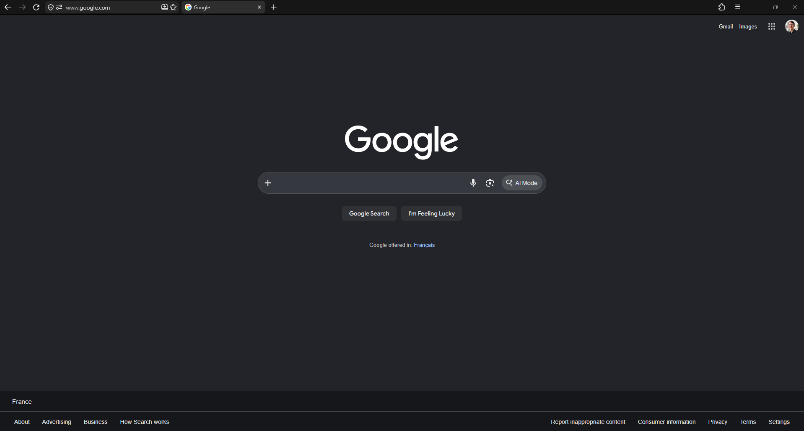

# vulpine

A compact Firefox theme in plain `userChrome.css`. Navigation buttons, the URL
bar and every tab share a single row. No fork, no build, no extension.



## Install

```bash
npx vulpine
```

The same command on Windows, macOS and Linux. Quit Firefox first, then start it
again once the installer is done. Node 16.7+ is the only requirement.

It targets the profile your browser actually opens, backs up any `chrome/`
folder already sitting there instead of overwriting it, and appends its prefs to
`user.js` without disturbing what you already keep in that file. Firefox,
LibreWolf, Waterfox, Floorp, Zen and Mullvad are all detected — on Linux,
Flatpak and Snap installs included.

| Flag | |
|---|---|
| `--all` | install into every profile found, no question asked |
| `--profile <path>` | target one specific profile |
| `--uninstall` | remove the theme and the prefs it set |
| `--force` | don't stop when the browser is still running |
| `--link` | symlink `chrome/` instead of copying it, from a clone |

## Make it yours

Every knob lives in
[`chrome/modules/_variables.css`](chrome/modules/_variables.css):

| Variable | |
|---|---|
| `--vp-row-height` | height of the row |
| `--vp-gap` | horizontal spacing between every item in the row |
| `--vp-urlbar-width` | fixed width of the URL bar |
| `--vp-tab-height`, `--vp-tab-radius` | tab shape |
| `--vp-bg-toolbar`, `--vp-bg-field`, `--vp-bg-tab-selected` | the three colours that carry the theme |
| `--vp-color-scheme` | `dark` or `light` — keep it in sync with your palette |

Hit `Ctrl+Shift+R` in the Browser Toolbox to reload the chrome without
restarting.

## Uninstall

```bash
npx vulpine --uninstall
```

The theme is removed, the prefs block is stripped out of `user.js` while the
rest of the file stays, and any backup taken at install time is reported back to
you.

## Notes

Built and tested against Firefox Nightly 157 on Windows 11. Chrome selectors and
theme tokens move between major releases, so expect to patch things after an
update. [`docs/internals.md`](docs/internals.md) covers how the single row is
built, where to find the real selectors, and the traps worth knowing about.

MIT.
